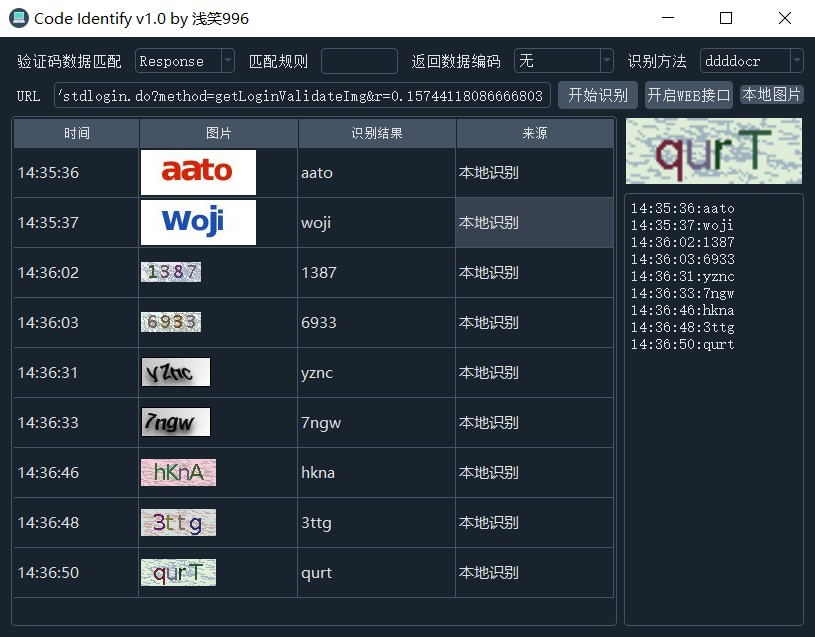
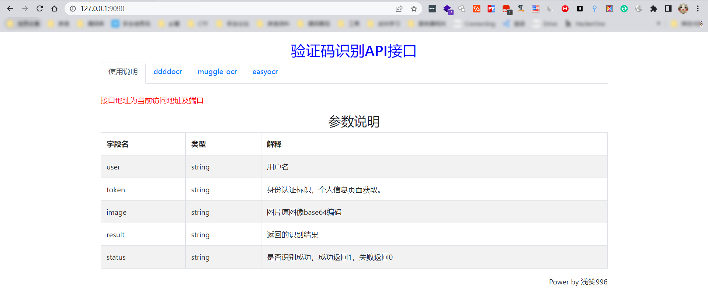

## code_identify



webapi（token字段暂时未添加，暂时不做验证）



验证码数据匹配类型：
1、Response
此类型代码返回包直接返回图像的raw格式源
2、Re Match 
此模式通过re正则表达式来匹配图像raw，表达式需自行编辑
3、Json Match
此模式仅限于返回包为json格式。通过response来匹配raw格式图像。
示例：
```
返回数据如下：
{"success":true,"data":"data:image\/png;base64,iVBORw0KGgoAAAANSUhEUgAAAIIAAAAqCAMAAABIknNMAAABnlBMVEXd3d0FXFRWjIc7fHanvLrCzMtxnJiMrKkgbGVeDFl9QHqNWorNwsxtJmleWw6trI99e0FtayeNi1vNzMOdnHW9vKlcCj2sjaF8PmW8qLVsJFGMWXmcc43MwskEqP1r93C\/rfDxDU0+DUSm7CARCLEmefZyVrrSVWnMXpl0tu\/4psLA0C06Kb4ax+NvUEVIfRfSMLhtVaoS1TbD65F4FsAhBp2vC29J1fUBBUYQ+8ExGrjYE94cJVj41WTV786lLCLEl+jAVpzpu\/KAORzluRY9WQHQJFfhevnFZtQcOOEJHtesXSvrf+KEJLLLRAmxvDVSnBTn1hnW\/gQ9PWcJugD8xRcNg\/WxCIQKoRpdS5dSzfVQT6b+dgSypaC8QRJrNJvWVcanHfh4TPyUMOZX8qj41f73ai7WZVXbR\/9AbfVcfpVf\/L2VVPoymncqY7F2aqlLxw\/3QMhZSfIEhqcRpnGtODvMo2w408RiWtHfWTVDmHxNYpM4Vl3h3QaOCDrpP7aMYV+6VnmZwoWEtXKuvGvfxNuO5f6\/zZWEw7+c5aO7lrndAAADpklEQVRYha3Y52\/TQBQA8HObjiTFrZ3WTTMYYi8xBYgNEkvsvTeILbZYYtlpkv7XnG\/Y77Zb+j74HPfGL+\/O57iohxCKUbHoFKnUZeVc4X4ywjq3YNEIYkc9tLJoFpyC1WhbbrAQkEywTMQW+OGDjvBRvSQTXhcgLI\/\/mAyWhjROuAnOnqxZOOUkaEIg7KQfri+YYGtYjFCkJ0yIc8LBxSHM4pibtYViKNa3nZD13qUDaLPQp9FBUNPPw9D3GStB\/V5gIvpy6HvKs6A0MEWhmnPZiDcVt5HgiqxhP\/\/aj9RqIAuXXD1lBivhqNgQ5Hyfprbvz\/+OcBC8LHBDZSm7CNP1KKrPZH+8N0\/CVXIcoDHoCcNXyk5CKqhHjWYziqaVWsrCJoYb6IqpW5L9En\/A\/VqDUNlNwIbvUR2X7UbUlgV6gi5W8PGHvEEBX4zAxp6JWjJBbdfTEx5TAD4MeyOgaZkEqPgmPYxP+EFYg4RoIz0jyVgYAd1FbP69Udi0Wi2Xq1Wp7qTvh2EQEMIOSmBZaEcNLWG3QDAY+AIc8YZFvToRU35Qw8UEzEIzaqYneEFqCWipYNAR8jtg1BtyEUJ\/fBkuhInACxHfEY26LguJMlxquCgJsrMSXYzAcFshBH6NlMK+0G5iRAtORJJGJ4GBr37hBBpruSAnDHol9FAg5Fk4zEo8tEqgMUPng44Pe2EX+VlP+lZgFxxii5E0fkUJb6Xq+y2EFtmbknwsTtgkdSIa4EY8zBYjaK2uhQl\/Ki2mVEK6NYHxQRLuyAS4IoVHAV+MAmFMaj5J7ohaAAnviaAetRJh8Zl\/+YA0vICCEW+An37mW+uucqXCrp1lZboxhUEo3BHR8fQRIQKsL0TAICahpHyFsUp5idw8DPxgEq+F\/G2qXT+JH5RU8EDqQR8xNVyTCHl8dXRAQ3yhy1LwrAgBb5L8zPyzwP1emRI2cEKibEGODmJuuGAxHNNc\/EGO6zMCjtOpQRVkSbjsIJimAhVIA58ITFAEzx1tiaH3mxtMiJTwxNzFEUiAf9jOynfkeMBsyO8LI6GDDpkFMAtM8MlWW2eIwZrcozcoV76R41MDwRB7zQawPxgmw7QatjLCT0awCmwRg5sTIP6iWxnBuiJ5FpL5EF7KBj0iD4mw+T8JXfVSLD43Ne8vljRk\/SWFZ6KL7qsGYTJ0Cp3hvEBIii8G3mSViEASAokvc+bl0D3nIvTkn0eaiUDsHy9KXcAwGlxZUDpF\/wC4\/FRGQVA\/dQAAAABJRU5ErkJggg=="}

匹配方法选择json match，匹配规则填写：response['data']，即可匹配到data:image\/png;base64,iVBORw0KGgoAAAANSUhEUgAAAIIAAAAqCAMAAABIknNMAAABnlBMVEXd3d0FXFRWjIc7fHanvLrCzMtxnJiMrKkgbGVeDFl9QHqNWorNwsxtJmleWw6......  然后返回数据编码选择 base64即可获取源图像。
```
其他使用技巧请自行摸索。